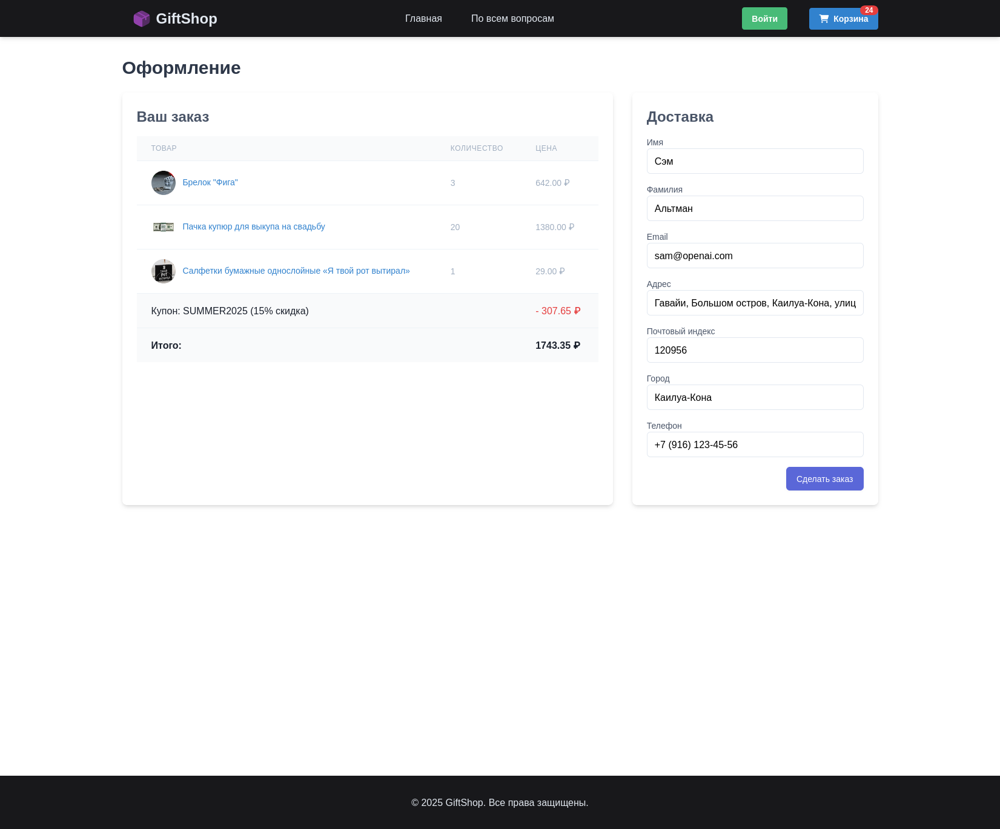

<div align="center">
 


# GiftShop

</div>

## Описание

### Интернет-магазин сувениров "GiftShop"

### Технологии

1. **Django `v5` + Django Templates**: Multi-Page Application
2. **Celery**: Распределенная асинхронная **очередь задач**
3. **RabbitMQ**: Брокер сообщений
4. **Redis**: Хранение задач **Celery** + **Кеш**
5. **Flower**: Мониторинг и управление задачами в **Celery**
6. **Postgresql**: База Данных
7. **TailwindCSS**: CSS-фреймворк, упрощающий стилизацию HTML и **адаптивный дизайн**

### Функционал

**Пользователи**: могут просматривать товары, добавлять их в корзину и совершать покупки, размещая заказы. Доступна регистрация и вход в профиль, активация купонов, просмотр истории заказов, отправка сообщений обратной связи.

**Администраторы**: могут полностью управлять основным функционалом магазина: его содержимым (товары, категории товаров, скидочные купоны), а также заказами пользователей. Могут выгружать заказы в CSV-формате, просматривать сообщения обратной связи.

<details>

<summary>Страницы</summary>

#### Страницы

**shop:**

- [x] Списки товаров
  - [x] Главная страница, со всеми товарами `giftshop.com/`
  - [x] Товары по категориям `giftshop.com/category/kopilki/`
- [x] Просмотр карточки товара `giftshop.com/1/kopilka-xxl-gold/`

**cart** и **coupons:**

- [x] Просмотр корзины `giftshop.com/cart/`
  - [x] Активация купона на скидку `giftshop.com/coupons/apply/`
- [x] Добавление товара в корзину `giftshop.com/cart/add/<id>/`
- [x] Удаление товара из корзины `giftshop.com/cart/remove/<id>/`

**orders:**

- [x] Оформление заказа `giftshop.com/orders/create/`
- [x] Просмотр истории заказов `giftshop.com/orders/`

**account:**

- [x] Вход/выход из профиля `giftshop.com/account` `/login/` | `/logout/`
- [x] Регистрация пользователя `giftshop.com/account/register/`

**info:**

- [x] Информационная страница `giftshop.com/info/`
- [x] Форма обратной связи

</details>

<details>

<summary>Admin-панель</summary>

#### Admin-панель

- Управление товарами и категориями товаров
- Управление купонами на скидку
- Просмотр и управление заказами, выгрузка заказов в CSV
- Просмотр сообщений обратной связи
- Управление пользовательскими профилями

</details>

## Установка

1. Настроить `.env` (в соответствии с `.env.example`)
2. Настроить веб-сервер **Angie**:
   - Конфигурация `angie/angie.conf`
   - Серверы в `angie/http.d/`, например `default.conf`

По умолчанию **Angie** сконфигурирован на прослушивание `:80` порта **со всеми server_name's**.

```bash
# Запуск проекта
docker compose -f docker-compose.prod.yaml up -d

# Добавление Django Superuser: Admin-аккаунт
docker compose run web python manage.py createsuperuser
```

## Галерея


---
### Остальные изображения
<details>
    <summary>Раскрыть</summary>
    
    
    
    
    
    
    
    
    
</details>
